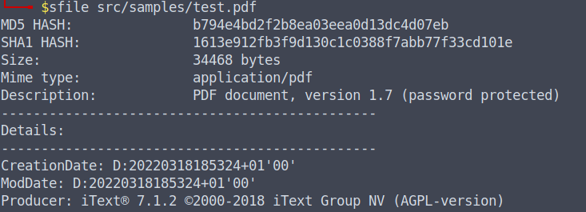

# sfile

## What is it?

sfile is a command line utility much similar to linux command "file" but on steroids.

## Features
In fact by launching sfile on a file sfile extracts all useful metadata for that file:

-MD5 Hash
-SHA1 Hash
-Size in bytes
-Mime Type
-Description

On some kind of files (e.g. exe, jpg, png, docx, xlsx, pdf, avi, mp3 etc...) it also extracts more detailed info if available.

## Usage
```
sfile [file path to analyze]
```


## Installation

To install from pypi:
```
pip install py-sfile
```

To install from the source directory:
```
pip install .
```

## Author

@gcarmix


